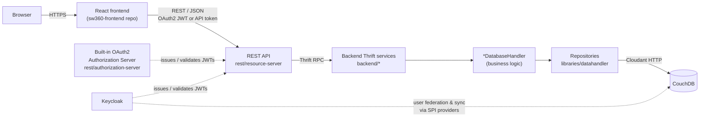

# SW360

[](https://eclipse.dev/sw360/)
[](LICENSE)
[](https://github.com/eclipse-sw360/sw360/releases/latest)
[](https://join.slack.com/t/sw360chat/shared_invite/enQtNzg5NDQxMTQyNjA5LThiMjBlNTRmOWI0ZjJhYjc0OTk3ODM4MjBmOGRhMWRmN2QzOGVmMzQwYzAzN2JkMmVkZTI1ZjRhNmJlNTY4ZGI)
[](CHANGELOG.md)
[](https://github.com/eclipse-sw360/sw360/actions?query=workflow:"SW360+Build+and+Test")
[](https://www.bestpractices.dev/projects/9485)

SW360 is an Eclipse Foundation open-source **software component catalogue and
license compliance management application**. It gives organizations a central
place to track the open-source and third-party components used across their
products, manage license and legal clearing information, and monitor known
vulnerabilities.

It is aimed at:

* **Legal / compliance / OSPO teams** who need to review license obligations
  and clearing status before a product ships.
* **Engineering teams** who need a catalogue of the components, releases and
  SBOMs (SPDX / CycloneDX) used in their projects.
* **Developers and integrators** who want to automate clearing or reporting
  workflows against the SW360 REST API.


### What SW360 gives you

* A catalogue of components, releases, vendors and their metadata.
* License and obligation tracking, including per-project clearing workflows
  and moderation requests.
* SPDX and CycloneDX SBOM import/export.
* Vulnerability tracking, including CVE-Search integration.
* A REST API for integrating clearing/reporting into other tooling.
* Authentication via Keycloak (OIDC/JWT), a built-in OAuth2 authorization
  server, or per-user API tokens.
* Optional [FOSSology](https://hub.docker.com/r/fossology/fossology/)
  integration for source code license scanning.

This repository contains the **backend**: the Thrift-based services, the
CouchDB data layer, the REST API, the Keycloak identity provider extensions,
and the build/migration tooling. The web UI lives in the separate
[`sw360-frontend`](https://github.com/eclipse-sw360/sw360-frontend) repository.

## Quick navigation

| I want to... | Go to |
|---|---|
| Run the full stack with Docker | [Getting started](#getting-started), [README_DOCKER.md](README_DOCKER.md) |
| Build and run the backend from source | [Local development](#local-development) |
| Run tests / formatting / license checks | [Testing and code quality](#testing-and-code-quality) |
| Contribute a change | [CONTRIBUTING.md](CONTRIBUTING.md) |
| Report a security vulnerability | [SECURITY.md](SECURITY.md) |
| Browse the REST API | [REST API documentation](#rest-api-documentation) |
| Run a database migration | [scripts/migrations/README.md](scripts/migrations/README.md) |
| Set up the Keycloak integration | [keycloak/README.md](keycloak/README.md) |
| Follow AI-agent / Copilot coding rules | [AGENTS.md](AGENTS.md) |
| See what changed between releases | [CHANGELOG.md](CHANGELOG.md) |

## Architecture

SW360 is split into a React frontend (separate repository), a Spring-based
REST API, a set of Thrift backend services, and a CouchDB data store.
Authentication is handled either by Keycloak or by SW360's own built-in
OAuth2 authorization server.



* **REST layer** (`rest/resource-server`): Spring Boot controllers
  (`*Controller`) expose `/api/...` resources. They delegate to `Sw360*Service`
  classes, which call the backend over Thrift using the static factory methods
  on `ThriftClients` — no service holds a live connection itself.
* **Backend layer** (`backend/*`): each module implements a Thrift service
  (defined in `libraries/datahandler/src/main/thrift/`) via a `*Handler`
  class (e.g. `ComponentHandler`), which holds a `*DatabaseHandler` (e.g.
  `ComponentDatabaseHandler`) containing the actual business logic. Handlers
  never talk to CouchDB directly.
* **Data layer** (`libraries/datahandler`): `*DatabaseHandler` classes call
  into `*Repository` classes, the only components allowed to read/write
  CouchDB, via the IBM Cloudant Java SDK. Full-text/relevance search uses a
  base Nouveau (Lucene-backed) search engine in `libraries/nouveau-handler`,
  used by concrete per-domain `*SearchHandler` classes (e.g.
  `ComponentSearchHandler`) that live in `backend/common`.
* **Identity**: REST requests are authenticated with a Keycloak-issued JWT,
  a JWT from SW360's own OAuth2 authorization server (`rest/authorization-server`),
  or a per-user API token stored in CouchDB. Keycloak itself is federated
  against the same CouchDB user database through the custom SPI providers in
  [`keycloak/`](keycloak/README.md), so both identity providers share one
  source of truth for users.

This is intentionally a simplified view — see
[AGENTS.md](AGENTS.md) and [.github/instructions/](.github/instructions/) for
the detailed layering, naming and DO/DON'T rules used during development.

## Repository structure

Only verified top-level paths are listed here.

| Path | Description |
|---|---|
| `backend/` | Thrift-based backend services (components, licenses, projects, vulnerabilities, packages, moderation, etc.) |
| `libraries/` | Shared libraries: Thrift-generated data model & CouchDB access (`datahandler`), import/export (`importers`, `exporters`), common IO helpers, and the Nouveau/Lucene search layer (`nouveau-handler`) |
| `rest/` | REST API — `resource-server` (public REST API), `authorization-server` (built-in OAuth2/JWT issuer), `rest-common` |
| `clients/` | Java client SDK for the SW360 REST API |
| `keycloak/` | Custom Keycloak 26.x SPI providers — user storage federation and event synchronization against CouchDB |
| `scripts/` | Build/test helpers, CouchDB data [`migrations/`](scripts/migrations/README.md) and one-off [`utilities/`](scripts/utilities/README.md), Docker entrypoint config, linters |
| `build-configuration/` | Shared Maven build configuration and test resources used across modules |
| `third-party/` | Thrift compiler build script, bundled third-party licenses, Keycloak Terraform config |
| `.github/` | CI workflows and [coding instructions](.github/instructions/) for contributors and AI agents |

Root files of note: [`README_DOCKER.md`](README_DOCKER.md) (backend container
image), [`CONTRIBUTING.md`](CONTRIBUTING.md), [`SECURITY.md`](SECURITY.md),
[`AGENTS.md`](AGENTS.md), [`CHANGELOG.md`](CHANGELOG.md), `Dockerfile`,
`docker_build.sh`, and the multi-module `pom.xml`.

## Getting started

The recommended way to try SW360 is Docker. This repository builds the
**backend** container images; the Docker Compose stack that wires the
backend together with the frontend, Keycloak and CouchDB is maintained in the
[`sw360-frontend`](https://github.com/eclipse-sw360/sw360-frontend) repository
— this repository does not itself contain a `docker-compose.yml`.

**Prerequisites**: a recent Docker version with `buildx` support.

**Step 1 — build the backend images from this repository:**

```sh
git clone https://github.com/eclipse-sw360/sw360.git
cd sw360
./docker_build.sh
```

This builds the Thrift image, the SW360 binaries image, and the SW360 runtime
image. See [README_DOCKER.md](README_DOCKER.md) for build options (e.g.
`--cvesearch-host`) and the full backend environment-variable/secrets
reference.

**Step 2 — run the full stack:**

Follow the compose-based stack setup, frontend build variables, and one-time
Keycloak bootstrap described in the sw360-frontend repository:
[SW360 Frontend Docker Guide](https://github.com/eclipse-sw360/sw360-frontend/blob/main/README_DOCKER.md).

For a non-containerized (bare metal) deployment, see the
[Bare Metal deployment guide](https://eclipse.dev/sw360/docs/deployment/baremetal/).

### Development vs. production defaults

SW360 ships with permissive defaults for local development. Review these
before any production deployment — see also the
[security best practices guide](https://eclipse.dev/sw360/docs/deployment/deploy-secure-deployment/)
and the
[guide on securing your deployment](https://eclipse.dev/sw360/docs/administrationguide/securing-sw360/).

#### HTTP Basic Authentication

HTTP Basic auth is **enabled by default** for local development/testing
convenience, backed by the `sw360.security.http-basic.enabled` property.

| Deployment | How to enable/disable |
|---|---|
| **Docker** | Set `SW360_SECURITY_HTTP_BASIC_ENABLED` in `config/sw360/.env.backend` (see [README_DOCKER.md](README_DOCKER.md)) |
| **Bare metal** | Set `sw360.security.http-basic.enabled=true/false` in `application.yml` (or pass as a JVM arg) |
| **Spring profile** | Activate the `prod` profile (`rest/resource-server` ships an `application-prod.yml`), which sets it to `false` |

> ⚠️ **Do not enable Basic auth in production.** Use OAuth2/JWT (Keycloak or
> the built-in authorization server) or API tokens instead.

Activate the production profile with:

```bash
# As a JVM argument
-Dspring.profiles.active=prod

# Or as an environment variable
export SPRING_PROFILES_ACTIVE=prod
```

## Local development

For working on the backend code itself, outside Docker.

### Prerequisites

| Requirement | Notes |
|---|---|
| Java 21 | Enforced by the Maven build (`[21,23)`) |
| Maven 3.9.0+ | Enforced by the Maven build |
| [pre-commit](https://pre-commit.com/) | Python-based; runs formatting/lint hooks |
| Thrift 0.20.0 runtime | Needed to (re)generate Thrift classes |
| Docker | Needed to run CouchDB for tests |

If you can't install the Thrift 0.20.0 runtime directly, you need a C++ dev
environment and `cmake`, then run:

```bash
./third-party/thrift/install-thrift.sh
```
### Development Prerequisites

Before building SW360 locally, make sure the following tools are installed:

- Java 21
- Maven 3.8.7 or newer
- Git
- Docker
- Python
- pre-commit
- Apache Thrift 0.20.0

Additional tools may be required depending on the module being developed.

### Clone the Repository

Clone the repository and enter the project directory:

```bash
git clone https://github.com/eclipse-sw360/sw360.git
cd sw360
```

### Build

```bash
git clone https://github.com/eclipse-sw360/sw360.git
cd sw360
pip install pre-commit
pre-commit install
```

> **Note:** `base.deploy.dir` (your Tomcat home directory) is enforced by a
> Maven Enforcer rule declared on the root `sw360` POM. Because that POM is
> part of the reactor for any full build, or any build using `-am`
> (also-make dependencies), a partial or module-level build — including
> library-only modules such as `libraries` — fails with the same error
> unless `base.deploy.dir` is set.

```bash
mvn package -P deploy \
    -Dhelp-docs=false \
    -DskipTests \
    -Dbase.deploy.dir=$TOMCAT_HOME
```

After changing a `.thrift` file under `libraries/datahandler/src/main/thrift/`,
regenerate the Thrift-derived classes. `datahandler` depends on
`build-configuration` and `libraries/nouveau-handler`, so those need to be
installed to your local Maven repository first — running `generate-sources`
on `datahandler` alone will fail to resolve them:

```bash
mvn install -pl build-configuration,libraries/nouveau-handler,libraries/datahandler \
    -am -DskipTests -Dbase.deploy.dir=$TOMCAT_HOME
```

### Running services

Running the built artifacts (Tomcat, CouchDB, and optionally Keycloak) is
documented in the [Bare Metal deployment guide](https://eclipse.dev/sw360/docs/deployment/baremetal/)
for non-Docker setups, and in [README_DOCKER.md](README_DOCKER.md) /
the [sw360-frontend Docker guide](https://github.com/eclipse-sw360/sw360-frontend/blob/main/README_DOCKER.md)
for containerized setups.

### Frontend

The web UI is maintained in the separate
[`sw360-frontend`](https://github.com/eclipse-sw360/sw360-frontend) repository
and is not part of this repository.

### Keycloak SPI providers (optional/advanced)

If you need to build the Keycloak user-storage/event-listener providers
locally instead of using the prebuilt images, see
[keycloak/README.md](keycloak/README.md), which documents the build command
and provider deployment steps in detail.

## Testing and code quality

Most tests require a running CouchDB instance (Docker required):

```bash
./scripts/startCouchdbForTests.sh   # starts CouchDB (and the Nouveau search sidecar) in Docker
mvn test                            # run all tests
mvn test -pl rest/resource-server   # module-specific
mvn test -pl backend/components
```

`rest/resource-server` also enforces test-coverage rules at build time via
ArchUnit (every Controller/Service needs a test class, every REST endpoint
needs an HTTP-exercising test):

```bash
mvn -pl rest/resource-server test \
  -Dtest="org.eclipse.sw360.rest.resourceserver.architecture.*Test"
```

Formatting and license headers:

```bash
mvn spotless:apply                              # auto-fix changed files (vs. origin/main by default)
mvn spotless:check                               # check changed files
bash .github/testForLicenseHeaders.sh            # verify EPL-2.0 headers on tracked files
```

> **Working from a fork** (see [CONTRIBUTING.md](CONTRIBUTING.md))? Spotless
> ratchets against `origin/main` by default, which assumes `origin` is
> `eclipse-sw360/sw360` with a fetched `main` branch. If `origin` is your
> fork instead, point Spotless at the canonical upstream branch, e.g. with a
> remote named `upstream` for `eclipse-sw360/sw360`:
>
> ```bash
> mvn spotless:check -Dspotless.ratchetFrom=upstream/main
> mvn spotless:apply -Dspotless.ratchetFrom=upstream/main
> ```

`pre-commit install` (see [Local development](#local-development)) wires up
formatting/lint hooks that run automatically on commit; a Checkstyle check
(`mvn checkstyle:check -Dcheckstyle.config.location=scripts/lint/checkstyle.xml`)
additionally runs on `pre-push`.

**CI-only checks** (see `.github/workflows/build_and_test.yml`): the full
suite also runs against a live CouchDB + Nouveau service pair, plus a few
scenario-specific test runs (`ProjectPermissionsVisibilityTest`,
`BulkDeleteUtilTest`) with extra system properties and Jacoco coverage
reporting — these are wired for CI and don't need to be reproduced manually
for everyday development.

## Basic usage example

Once an instance is running and you're authenticated (via Keycloak, the
built-in OAuth2 server, HTTP Basic in dev, or an API token), a typical
clearing workflow looks like this, either from the web UI or via the REST API
(`/api/components`, `/api/releases`, `/api/projects`, `/api/licenses`):

1. Create a **Component** (e.g. a library your product depends on).
2. Add one or more **Releases** (versions) to it, attaching source/binary
   files and license information.
3. Link the relevant Releases into a **Project**.
4. Track the project's clearing status as legal/compliance reviews license
   obligations and vulnerabilities, using moderation requests where changes
   need approval.

## Contribution and security

Contributions are welcome as GitHub pull requests. In short: fork the repo,
branch, make sure every new file has an EPL-2.0 header, sign off your commits
(`git commit -s`) using the conventional-commit style, make sure tests pass,
and open a PR. See [CONTRIBUTING.md](CONTRIBUTING.md) for the full Eclipse
process (ECA sign-off, IP checks) and review/merge criteria.

Please **do not** report security vulnerabilities through public issues or
PRs — see [SECURITY.md](SECURITY.md) for the coordinated-disclosure process
and supported versions.

## Documentation index

* [README_DOCKER.md](README_DOCKER.md) — backend container image build,
  runtime configuration, secrets, and volumes
* [CONTRIBUTING.md](CONTRIBUTING.md) — contribution process and Eclipse
  requirements
* [SECURITY.md](SECURITY.md) — vulnerability reporting and supported versions
* [AGENTS.md](AGENTS.md) — rules for AI coding agents / Copilot, with links
  into [.github/instructions/](.github/instructions/) (backend architecture,
  testing, security/auth, CouchDB, commit style)
* [keycloak/README.md](keycloak/README.md) — Keycloak SPI provider
  architecture, configuration, and build/deploy steps
* [scripts/migrations/README.md](scripts/migrations/README.md) — CouchDB
  data migration scripts, one per schema change, in upgrade order
* [scripts/utilities/README.md](scripts/utilities/README.md) — one-off
  CouchDB utility/repair scripts
* [CHANGELOG.md](CHANGELOG.md) — release notes
* [CODE_OF_CONDUCT.md](CODE_OF_CONDUCT.md) — community expectations

### REST API documentation

* Source of the REST API guide (AsciiDoc, built into HTML with Spring REST
  Docs at build time): [`rest/resource-server/src/docs/asciidoc/api-guide.adoc`](rest/resource-server/src/docs/asciidoc/api-guide.adoc)
* A running instance also exposes a live OpenAPI document at `/v3/api-docs`
  and an interactive Swagger UI (see
  [`rest/resource-server/src/main/resources/application.yml`](rest/resource-server/src/main/resources/application.yml)
  for the exact `springdoc` configuration).

### External project documentation

* [Official project homepage](https://eclipse.dev/sw360/)
* [Project documentation](https://eclipse.dev/sw360/docs/)
* [Container / Docker deployment](https://eclipse.dev/sw360/docs/deployment/containers/)
* [Bare metal deployment](https://eclipse.dev/sw360/docs/deployment/baremetal/)
* [`sw360-frontend`](https://github.com/eclipse-sw360/sw360-frontend) — the
  web UI and Docker Compose stack

## License

SPDX-License-Identifier: EPL-2.0

This program and the accompanying materials are made available under the
terms of the Eclipse Public License 2.0, which is available at
[https://www.eclipse.org/legal/epl-2.0/](https://www.eclipse.org/legal/epl-2.0/).
