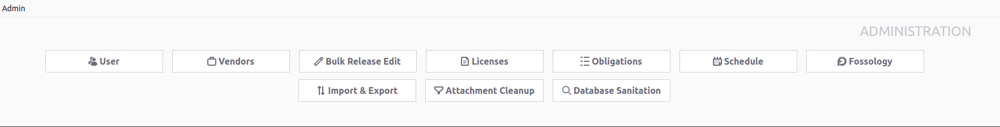

[//]: # (Copyright Siemens AG, 2021. Part of the SW360 Portal Project)
[//]: # (This program and the accompanying materials are made)
[//]: # (available under the terms of the Eclipse Public License 2.0)
[//]: # (which is available at https://www.eclipse.org/legal/epl-2.0/)
[//]: # (SPDX-License-Identifier: EPL-2.0)

# Admin Menu
-------------------

The **admin menu** consists of the following items:

- **User**: Displays the list of **Liferay Users**. One can also download or upload new users in this section

- **Vendors**: Displays the list of the **Vendors** that can be managed by the admin

- **Bulk License Edit**: List of licenses can be edited together in this section

- **Licenses**: Functions such as Download License Archive, Upload License Archive, Import SPDX Information and Delete License Information can be done in this section

- **Obligations**: To manage different types of Obligations on the basis of obligation level and obligation type

- **Schedule**: To schedule tasks such as CVE Search

- **Fosology**: Connection to the Fossology server

- **Import and Export**: Can Import and Export **Component**, **Release** and **License** information

- **Attachment Cleanup**: To cleanup attachment database

- **Database Sanitization**: Helps in searching for duplicate identifiers