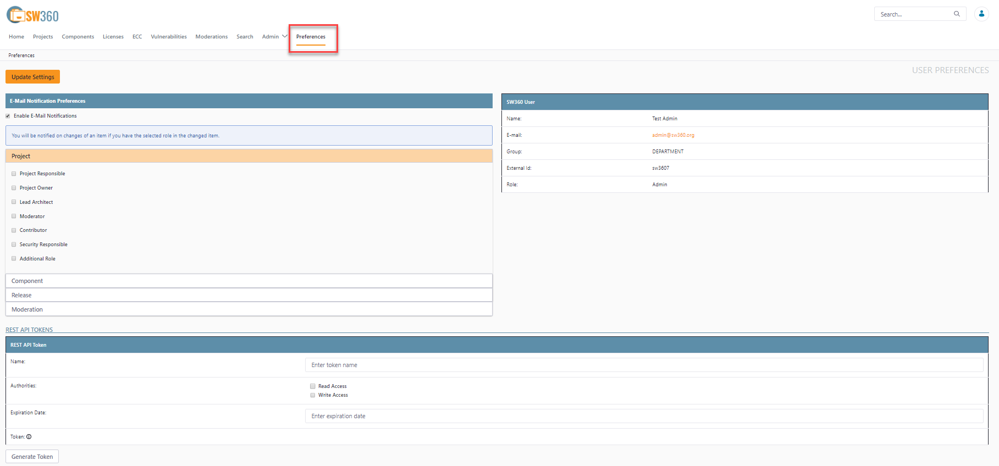
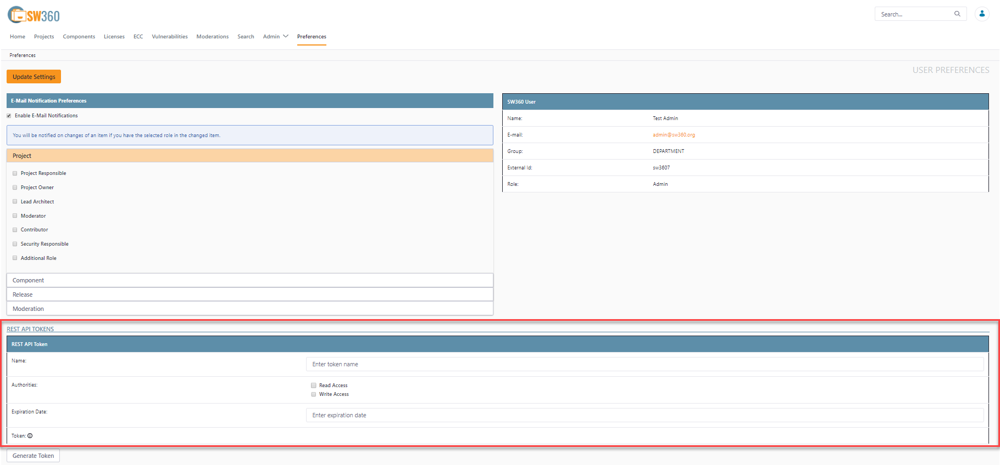

[//]: # (Copyright Siemens AG, 2021. Part of the SW360 Portal Project)
[//]: # (This program and the accompanying materials are made)
[//]: # (available under the terms of the Eclipse Public License 2.0)
[//]: # (which is available at https://www.eclipse.org/legal/epl-2.0/)
[//]: # (SPDX-License-Identifier: EPL-2.0)

# RESTful API Access
-----------------------

## How to get Access

There are the following steps

1. Open a browser with developer tools

2. Go to
    `https://<my_sw360_server>/authorization/client-management`

3. To add a new client, enter the following javascript in the dev tools
console

        xmlHttpRequest = new XMLHttpRequest();
        xmlHttpRequest.open('POST', '/authorization/client-management', false);
        xmlHttpRequest.setRequestHeader('Content-Type', 'application/json');
        xmlHttpRequest.setRequestHeader('Accept', 'application/json');
        xmlHttpRequest.send(JSON.stringify(
          {
            "description" : "my first test client",
            "authorities" : [ "BASIC" ],
            "scope" : [ "READ" ],
            "access_token_validity" : 3600,
            "refresh_token_validity" : 3600
          }
        ));
        console.log(xmlHttpRequest.responseText);

4. To manipulate an existing client, do the same but add the clientid to
the data object

    `"client_id" : "9e358ca832ce4ce99a770c7bd0f8e066"`<br>
to remove an existing client, enter the following javascript in the
dev tools console

        xmlHttpRequest = new XMLHttpRequest();
        xmlHttpRequest.open('DELETE', '/authorization/client-management/9e358ca832ce4ce99a770c7bd0f8e066', false);
        xmlHttpRequest.setRequestHeader('Content-Type', 'application/json');
        xmlHttpRequest.setRequestHeader('Accept', 'application/json');
        xmlHttpRequest.send();
        console.log(xmlHttpRequest.responseText);

5. You receive the token from such request, which looks like

        {
          "access_token" : "eyJhbGciOiJSUzI...",
          "token_type" : "bearer",
          "refresh_token" : "eyJhbGciOiJSUzI1...",
          "expires_in" : 599,
          "scope" : "READ WRITE",
          "jti" : "42539b0d-..."
        }

6. You can try a request which uses for example the tool curl:
`curl -X GET -H "Authorization: Bearer [token]" -H "Content-Type: application/json"`

7. You can get a new token (you must get a new token) after expiration using client id and secret:
`https://<my_sw360_server>/authorization/oauth/token?grant_type=refresh_token&refresh_token=[refresh_token]`

## Deprecated Method: Access Tokens from the SW360 UI
Recently SW360 has changed, username/password authentication is not possible anymore. So after successful entitlement login, the user is able to obtain a token with limited validity of time.

Our tests have confirmed that, if you have used the JWT authentication workflow, the change means for you:

- No interaction with authorization service is necessary.
- The token needs to be provided as with the JWT.

Please find attached, where to obtain the token:



And then find the interface for issuing the tokens:



### Token into which Header?
If you are used to REST clients, you might know that you need some kind of authentication info. Below are the previous and current ways of adding the authentication info to the HTTP header. Now you should add to the header the token value that you can obtain from the sw360 UI (see above):

`Authorization: Token <Token-Value>`

Previously, when you got the authentication info via the authorization service, it was:

`Authorization: Bearer <JWT-Value>`

### Example: PowerShell Script
This is an example Thomas Graf has sent around one - might be good to see how this works in general:

```powershell
$baseUri = "https://<my_sw360_server>/resource/"
$uri = $baseUri + "api/projects" $data = @"
{   "name" : "My 5th Dummy Project",
    "description" : "Read/write test",
    "version": "1.0",
    "tag": "my tag",
    "ownerGroup": "GROUP",
    "projectType": "PRODUCT",
    "linkedProjects": {},
    "linkedReleases": {}
} "@
$headers = New-Object "System.Collections.Generic.Dictionary[[String],[String]]"
$headers.Add('Content-Type', 'application/hal+json')
$headers.Add('Authorization', 'Token ' + $env:SW360StageToken)
$headers.Add('Accept', 'application/hal+json')
Invoke-WebRequest $uri -Method POST -Body $data -Headers $headers
```

## Deprecated Method: Authentication with Username and Password

### If I am not using token, but SW360 elsewhere: how do I obtain tokens?
There are two steps you need to do with your client. First, Obtain an authorization token. This can be done by executing on the development instance for example be:

```bash
curl -X POST --user 'trusted-sw360-client:sw360-secret' \
-d grant_type=password&username=user@sw360.org&password=12345 \
https://<my_sw360_server>/authorization/oauth/token -k
```

 Of course, for the staging instance, the user must be your user credentials and the trusted client secret looks different.

 Second you need to parameterize your request with this token. Pls. see the link at the very top 'Technical Information': [<span style="color:red">&#8599;</span> https://github.com/sw360/sw360portal/wiki/REST-API](https://github.com/sw360/sw360portal/wiki/REST-API) for more information.

### FAQ
- When I use the JWT approach I used curl to retrieve the token and get

	{"error":"unauthorized","error_description":"No AuthenticationProvider found for org.springframework.security.authentication.UsernamePasswordAuthenticationToken"}

- Your password seems to be wrong.

	Note, that with curl - you have to escape special characters in your password. E.g. password
123$abc
results in the following request

```bash
curl -X POST --user 'trusted-sw360-client:sw360-secret' \
-d grant_type=password&username=user@sw360.org&password=123\$abc \
https://<my_sw360_server>/authorization/oauth/token -k
```
