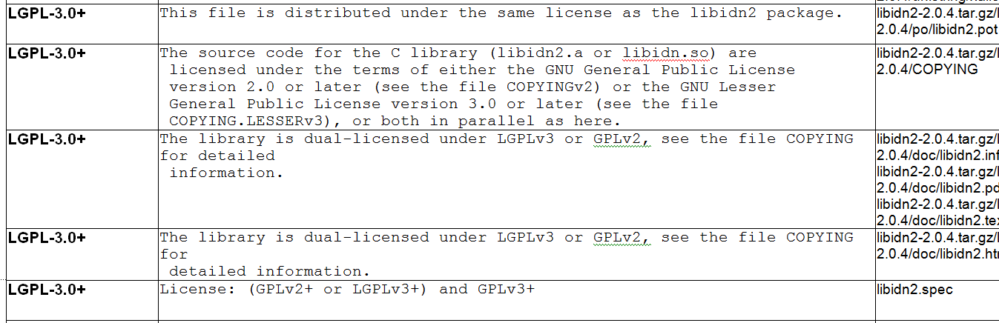

[//]: # (Copyright Siemens AG, 2021. Part of the SW360 Portal Project)
[//]: # (This program and the accompanying materials are made)
[//]: # (available under the terms of the Eclipse Public License 2.0)
[//]: # (which is available at https://www.eclipse.org/legal/epl-2.0/)
[//]: # (SPDX-License-Identifier: EPL-2.0)

# SW360 License Naming
---------------------------

## License Naming Guidelines
Generally the license naming should conform with the SPDX Spec and the SPDX License List

Please see the "License List Fields" from [&#8599; https://spdx.org/spdx-license-list/license-list-overview#fields](https://spdx.org/spdx-license-list/license-list-overview#fields)

where there is especially for identifier:

#### License or Exception Identifier (aka "SPDX Short Identifier")

Short identifier to be used to identify a license or exception match to licenses or exceptions contained on the SPDX License List in the context of an SPDX file, in source file, or elsewhere

- Short identifiers have no spaces in them
- Short identifiers consist of an abbreviation based on a common short name or acronym for the license or exception
- Where applicable, the abbreviation will be followed by a dash and then the version number, in X.Y format
- Where applicable, and if possible, the short identifier should be harmonised with other well-known open source naming sources (i.e., OSI, Fedora, etc.)
- Short identifiers should be as short in length as possible while staying consistent with all other naming criteria

This lead to expressions like "Apache-2.0" or "GPL-2.0".

## License Exceptions
As a provisoric handling advise, the exception text shall be combined with the license text as a license entry. This ensures that license and exception appear together in the clearing report.

Class Path Exception

Linking this library statically or dynamically with other modules is making a combined work based on this library. Thus, the terms and conditions of the GNU General Public License cover the whole combination.

As a special exception, the copyright holders of this library give you permission to link this library with independent modules to produce an executable, regardless of the license terms of these independent modules, and to copy and distribute the resulting executable under terms of your choice, provided that you also meet, for each linked independent module, the terms and conditions of the license of that module. An independent module is a module which is not derived from or based on this library. If you modify this library, you may

## Dual Licenses
There is the need to have a dual license text. FOSSology offers the dual license tag for this. The idea is to use this tag also for more than two licenses.

Consider the following example:

The fact that it is "LGPL-3.0+" is confusing for these texts. It should be changed to the following:

- The License results shall be changed "Dual-License". This is among other things required, to have the obligation to understand that for this component a license must be chosen
- In the acknowledgement, there shall be documented which license decision comes is documented
- For the referring files, also the different other licenses must be added as conclusions, so the texts are printed out.

## Quick Checklist
- Shortname: No spaces, No slashses, No unserscore or similar spcial charaters, just use dashes
- Consider existing SPDX short names
- Do not use "Or later" but "+" or "-or-later"
- For triple licensing, use prefix "Triple"
- ERASE COMMENT CHARACTERS! also erase prefix spaces at every line
- Preserve paragraphs and line breaks
- Avid markup in the license text except it is part of the licensing

## Multi (DUAL-) Licensing
- VERY Important, as conclusion, use the FOSSology "Dual-license", please do not consider your own candidate just designating "Dual License" (because OR operators will not work in reporting)
- For Dual License texts use prefix "Dual-"
- For Triple, use "Triple-" (and for more "Quadruple-")
- For Dual Licensing, use alphabetical order to name the licenses
- SPDX provides the rule to have this merged with "OR" (in capital letters) like "Dual-MIT-OR-BSD"

## Examples for Renaming
| Example Licence Short Name | Corrected Licence Short Name | Remarks |
| --- | --- | --- |
| BSD-3-Clause-Farin Urlaub | BSD-3-Clause-farin-urlaub | no empty spaces |
| GPL-2.0+_Variant Old address | GPL-2.0+-variant-old-address | no underscore |
| --Freeware | Freeware-variant-dumbumchong | no prefix dashes |
| BSD-3-Clause\IBM | ... | do not use slashes (back and forward) |
| Permission Notice Gordon Sumner | HPND-gordon-sumner | consider SPDX shot name "HPND" for permission notice |
| BSD-3-Clause_Ajax.org B.V. | BSD-3-Clause-ajax | |
| BSD-3-Clause_Yahoo! Inc | BSD-3-Clause-yahoo | |
| BSD-2-Clause CISCO | BSD-2-Clause-cisco | |
| --zlib-style | Zlib-variant-01 | This license could be deleted anyway. (no text) |
| woodstock | Woodstok-Reference-Disclaimer | 1. All short names shall begin with capital letter, 2. (not shown), the license text is not a license text actually, but just a reference in a header with disclaimer. |
| Visual Studio SDK license terms | Microsoft-Visual-Studio-SDK-2015 | looking at the text, it is from the 2015 version of the SDK |
| Trip MPL GPL Apache | Triple-Apache-2.0-LGPL-2.1-MPL-1.1 | (looking at the text it was LGPL in fact) |
| --FIPL-1.0 | FIPL-1.0 | Double dash is an old thing coming from mainline ops. Currently there is no similar convention known for FOSSologyNG. |
| Qt License Agreement_CEM | Qt-reference-commercial | In this case, it was reference text only and also only pointing to the commercial licensees only. |
| --Beer-ware-license-CEM01 | `Beerware` | The text says actually revision 42, revision 42 is a joke. It must be checked if the license is already there |
| FundsXpress License | FXL | Either FundsXpress or FXL because the point is to have a short name and thus, it would make sense to shorten it. |
| GFDL - 1.2+ | GFDL-1.2+ | just without spaces please |
| lgpl 2.1 J | LGPL-2.1-header | (was a header in this case, because lic text is already there) What does J mean? - no J needed |
| MIT ! | *do not use candidate licenses* | Actual text was: "This program is made available under the terms of the MIT License." - actually, not a license text! |
| Note | *do not use this with candidates* | Actual text was: "("See [&#8599; http://oxyplot.codeplex.com](http://oxyplot.codeplex.com) for more information.")" |
| Permission_Notice_Timothy O'Malley | HPND-omalley | do not use special chars, do use SPDX identfiers |

## Notice File
The following text is not a license statement nor a reference to licensing but a notice file in the sense of the apache 2.0 license. As such, it is not suitable for being collected as a license.

`== NOTICE file corresponding to the section 4 d of ==`

`== the Apache License, Version 2.0, ==`

`== in this case for the Apache Ant distribution. ==`

 =========================================================================

`This product includes software developed by`

 `The Apache Software Foundation` ([&#8599; http://www.apache.org](http://www.apache.org/)).

`This product includes also software developed by :`

 - `the W3C consortium` ([&#8599; http://www.w3c.org](http://www.w3c.org)),
 - `the SAX project` ([&#8599; http://www.saxproject.org](http://www.saxproject.org))

`Please read the different LICENSE files present in the root directory of this distribution.`

## Open Questions
- How to deal with notice files

(1) [&#8599; https://spdx.org/spdx-specification-21-web-version](https://spdx.org/spdx-specification-21-web-version)
