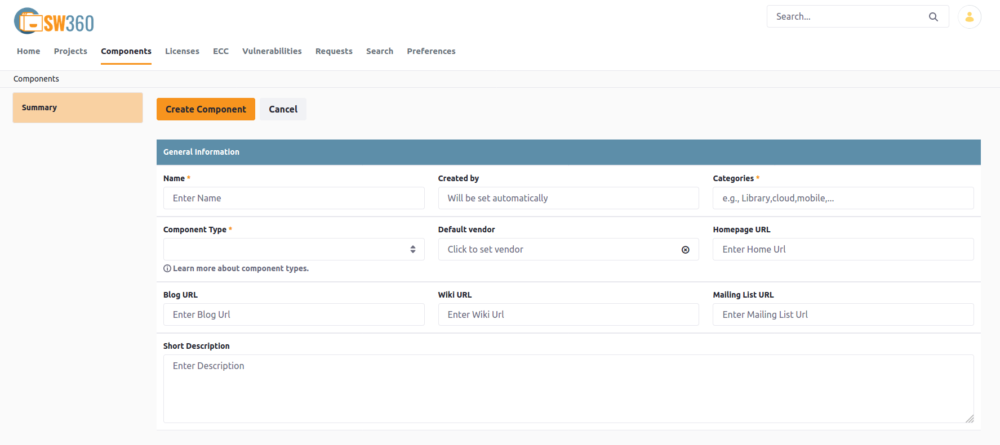
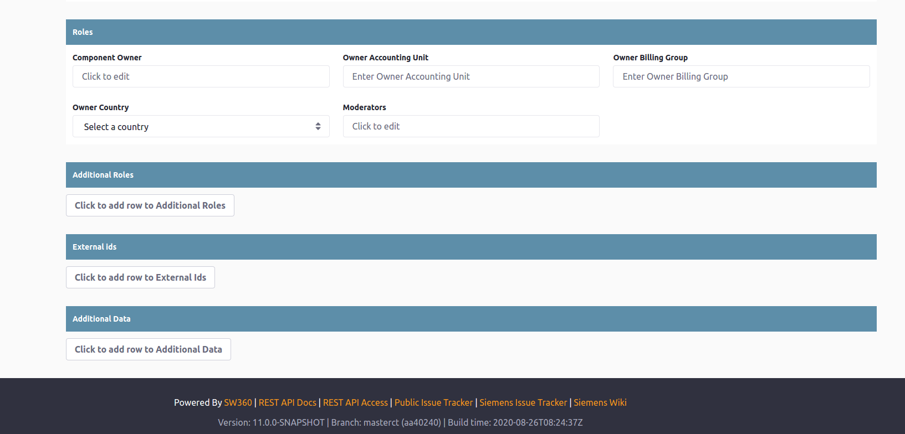
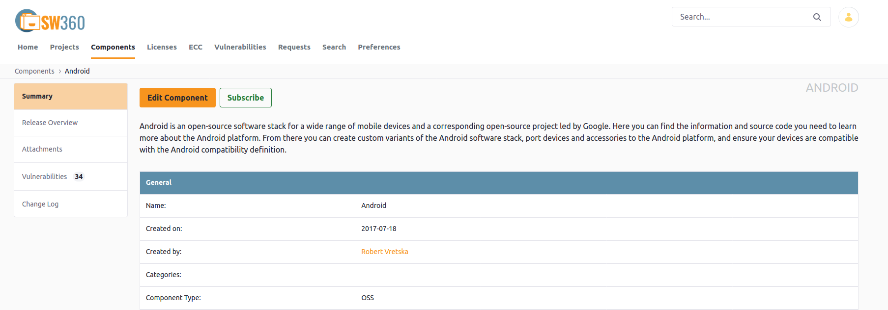
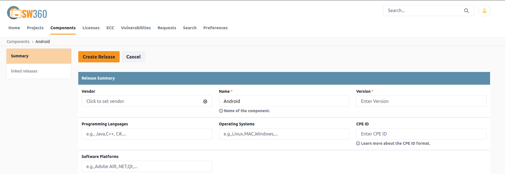
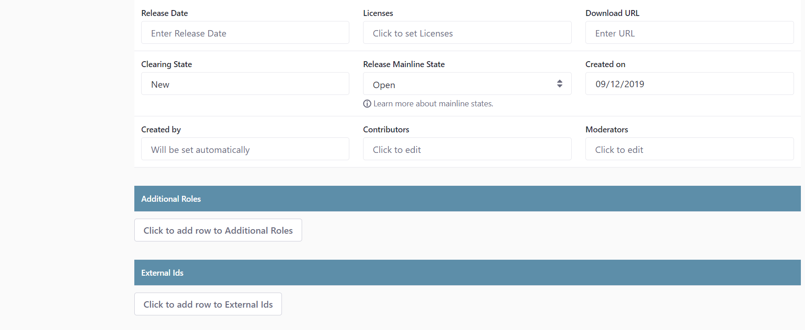
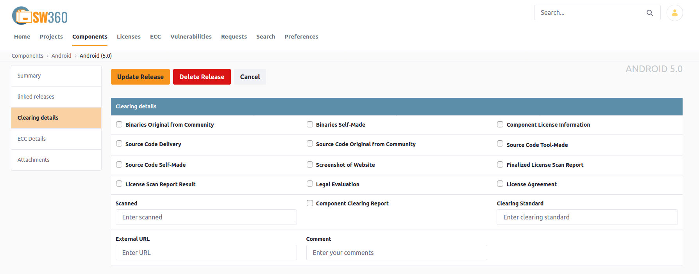
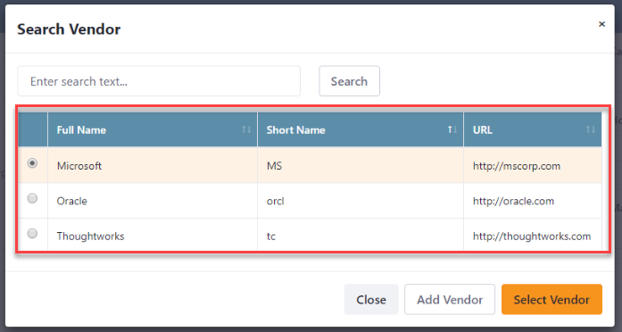
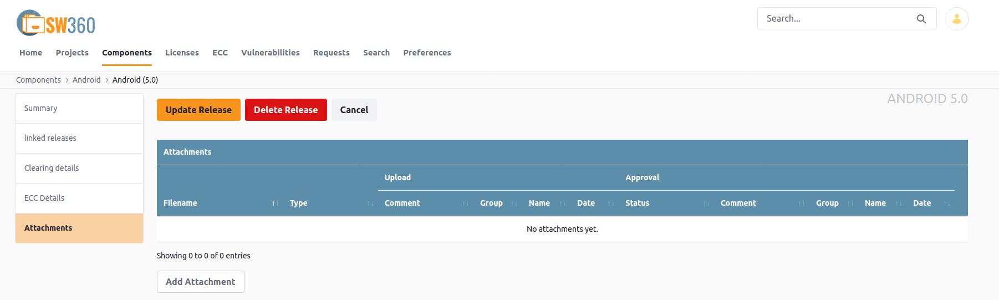

[//]: # (Copyright Siemens AG, 2021. Part of the SW360 Portal Project)
[//]: # (This program and the accompanying materials are made)
[//]: # (available under the terms of the Eclipse Public License 2.0)
[//]: # (which is available at https://www.eclipse.org/legal/epl-2.0/)
[//]: # (SPDX-License-Identifier: EPL-2.0)

#Components and Releases
-----------------------

## Search for a Component

1. Switch to Components view
2. Use filters to refine search
3. Following filters can be used to make the seach efficient and faster:
	- **Component Name**
	- **Categories**
	- **Component Type**
	- **Languages**
	- **Software Platforms**
	- **Operating System**
	- **Vendors**
	- **Main Licenses**
	- **Created By(email)**
	- **Created On**

## Create a New Component

**NOTE**: Before adding a new component, search for the component to ensure that it does not already exist.
Think also about other potential names of the component.

The menu item **Components** shows a list of all available components. There are three important buttons on the page:

- **Add new Component**: Opens a dialog window for creating a new component

- **Export Spreadsheet**: Makes components available for other users

- **Import SPDX BOM**: Import Components and Projects from the SPDX

The dialog for creating a component contains the following entries.

**General Information** includes the following fields:

- **Name***: Unique name of the component
- **Created By**: Owner of the componenet, will be set automatically
- **Categories***: Possible values can be Library, Cloud, Mobile etc
- **Component Type***: Types of component can be OSS, COTS, Internal, Service, Freeware, Inner Source, Code Snippet
- **Default Vendor**: To set the vendor
- **Homepage URL**: Link that leads to the homepage of the component
- **Blog URL**: Link that leads to the discussion or informational website of the component
- **Wiki URL**: Link that leads to the wiki of the component
- **Mailing List URL**
- **Short Description**: Explanation for the newly created component

**Roles** includes the following fields:

- **Component Owner**: Holder of the component
- **Owner Accounting Unit**: The owner accounting unit of the component
- **Owner billing Group**: The owner billing unit of the component
- **Owner Country**: Country from which the owner belongs
- **Moderators**: A list of moderators responsible for the component.

At the bottom there are buttons to add **Additional Roles**, **External Ids**, and **Additional Data** for the new component.

After pressing the **Create Component** button you get a feedback, wether the creation was sucessful or not.

Now you can go ahead with the creation of a new release.

**NOTE**: Depending on the rights of the user, new component do not appear immediately in the component list. In this case this action created a so called *moderation request* which first needs to get approved by an administrator.

## Adding a Release to a Component
To add a release to a component, select the component first. This can be accomplished in two ways:

- Go to the home page and select the component from the "My Components" list

- Click the "Components" button from the top menu and search for the component.

In this case we choose the new created component "Android" from the home page list. The detail page for the component "Android" contains two buttons:

- **Edit Component**: Here you can change component information and add releases to the component

- **Subscribe**: Subscribe to the component to get notifications, when any changes of the component occur.

On the left side the detail page contains a menu for:

- **Summary**: Show this page

- **Release Overview**: Show a list of the associated releases of the component

- **Attachments**: Show the attachments of the component; attachments can be source code, documents, clearing reports, ...

- **Vulnerabilities**: A link to the vulnerabilities

- **Change Log**: Shows the changes done on the release

Press the button "Edit Component" for the component "Android". A detail page for the component is shown, then go to **Releases** section where you can find a button "Add Releases".

A detail page for the release is opened. Mandatory fields are:

- **Name**: The name of the component, e.g. "Android"

- **Version**: A version number of the release, e.g. "0.8.13"

Additional information for the release can be entered:

- **Programming Languages**: A list of used programming languages

- **Operating Systems**: List of Operating Systems.

- **CPE ID**: Common Platform enumeration id should be unique

- **Software Platforms**: List of softwares required for the release

- **Release Date**: Date of the release

- **Download URL**: URL from where the source of the release can be downloaded

- **Clearing State**: Possible values are "New", "Sent to Fossology", "Under Clearing" and "Report Available"

- **Mainline State**: Status of the release if it has been already recorded in "Mainline"

- **Contributors**: A pointer (e.g. email address) to a contributors for the release

- **Moderators**: A list of moderators responsible for the component.

After entering the information, press the button "Create Release" to add the new release to the component.

It is possible to edit the basic data for the release and update the information (button **Update Release**). With the menu on the left side further information can be entered.

**Release Summary** Show the detailed information about the release.

**Linked Releases** In order to link a release to the current release

**Release Clearing** Information.

**Vendors**

**Attachments**
This page shows a list of all attachments associated with the component. To add a new attachment press the button **Add Attachment**.

A new dialog box is shown where you can drop a file or use a file browser to choose an attachment. In the example a zipped archive is choosen and the type of the attachment is set to source. To finish the action press **Update Release**.

## External Ids
SW360 allows to add so called 'external ids' to a release. This can be links to other systems, see table below. Especially we recommend to add information about package management system to allow a **unique identification** of a release.

| **External ID Name** | **Example Value** | **Description** |
| --- | --- | --- |
| nuget-id | common.logging.2.2.1 | ID of the release in Nuget, format is (component ID).(version) or use a package url: pkg:nuget/common.logging@2.2.1 |
| maven-id | javax.activation:activation:1.1.1 | ID of the release at Maven, format is (group ID):(artifact ID):(version) or use a package url: pkg:javax.activation/activation@1.1.1 |
| npm-id | moment@2.19.1 | ID of the release at NPM, format is (package)@(version) (like npm install (package)@(version)) or use a package url: pkg:npm/moment@2.19.1 |
| bower-id | **(TBD)** | ID of the release at Bower, format is (package)#(version) (like bower install jQuery#2.1.4) ??? no unique package id ??? |
| package-url | `pkg:nuget/EnterpriseLibrary.Common@6.0.1304` | A package URL, based on the specification available here: [&#8599; https://github.com/package-url/purl-spec](https://github.com/package-url/purl-spec). The goal is a) to have ONE external id name and not multiple names like nuget-id, maven-id, etc. b) conform to some kind of standard |
| (golang => use package-url) | `pkg:golang/google.golang.org/genproto#googleapis/api/annotations` | see package url specification |

**NOTE**: Changes to the export control information done by normal users always requires the approval of one the assigned export control experts.

## Adding Attachments
Attachments can get added to a release, a component or a project.

The most important attachment types are:

| Symbol | Type | Description |
| --- | --- | --- |
| SRC | Source Code | Source code of a release, required for OSS components, only for releases This shall be the original source code from the developers of the component, **not** from NuGet, **not** from Maven, etc. |
| CRT | Clearing Report | Clearing report, for releases or projects |
| CLX | Component License Information (XML) | Input for Readme_OSS generation, only for releases |
| DOC | Document | Any kind of document |
| BIN | Binaries | Binaries of a COTS or OSS component. Binaries for OSS component should only get uploaded if the software clearing team has allowed the use of the binary |
| DRT | Decision report | Used by some Divisions to document a clearing decision |
| LRT | Legal evaluation report | Documentation by the legal team |
| LAT | License agreement | License agreement document, nearly always required for commercial components (COTS). Before uploading please ensure that you are **allowed** to upload such a document |
| SCR | Screenshot of website | Helpful, when there is no license information inside the source code but on the component website |
| RDM | Readme_OSS | Third-party software information. Summary of the information about 3rd party software components shipped together with a product. |
| OTH | Other | Any other kind of file |

**NOTE**: Choosing the wrong attachment type may slow down or stop the further processing of a release or product!

## Add a New Component to a Project

Step-by-step:

1. The component must already exist in SW360 – if not please add the new component

2. Search for the project

3. Select the project and click on 'Edit Project'

4. Select 'Linked Releases and Projects' (on the left side)

6. Select the 'Add Release' button

7. Search for the release

8. Click 'Select'

9. Click 'Update Project'

## Remove a Component/Release from a Project

Step-by-step:

1. Go to 'Projects'

2. Search for the project

3. Select the project and click on 'Edit Project'

3. Select 'Linked Releases And Projects' (left side)

4. Scroll down to section 'Linked Releases'

5. Click on the trash bin icon on the right side of the component release you'd like to remove

6. Acknowledge remove warning

7. Click 'Update Project'

**NOTE**: Only software clearing experts can remove releases or components from SW360. If you have created releases or components that should get removed please contact your local software clearing site expert.
