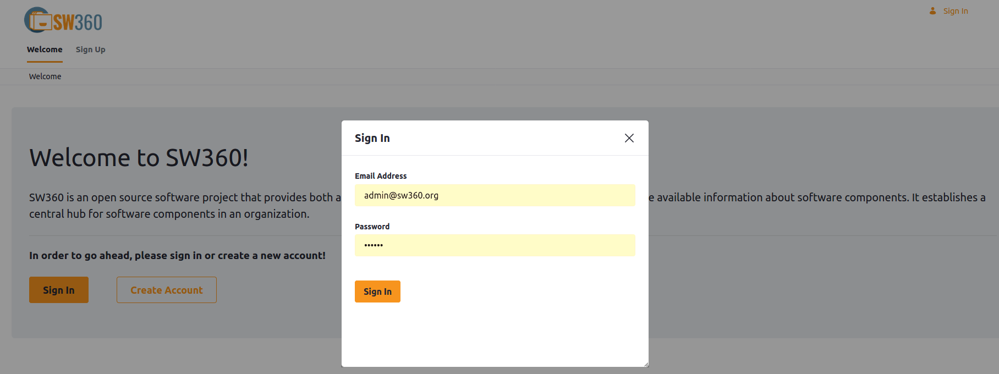
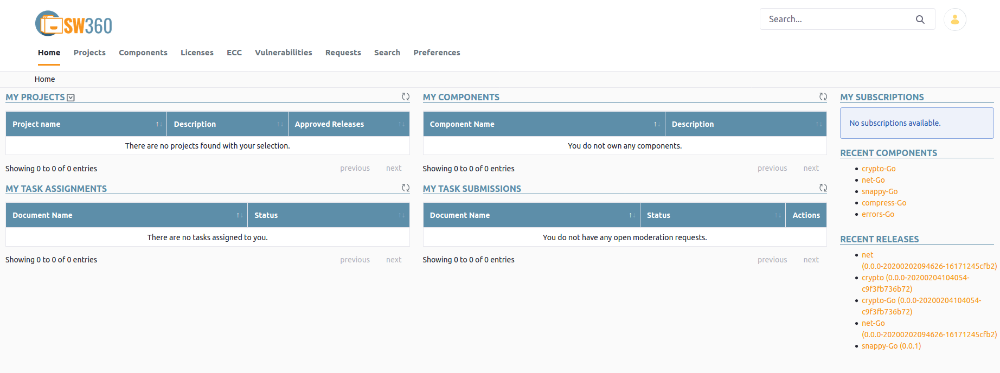

[//]: # (Copyright Siemens AG, 2021. Part of the SW360 Portal Project)
[//]: # (This program and the accompanying materials are made)
[//]: # (available under the terms of the Eclipse Public License 2.0)
[//]: # (which is available at https://www.eclipse.org/legal/epl-2.0/)
[//]: # (SPDX-License-Identifier: EPL-2.0)

# Login to SW360
-----------------------

You need a username and a password to access the software. After reaching the SW360 site you will be in the public area of your account. Liferay distinguishes between public and private area, where the private area is protected by login.

You will see a "Welcome to SW360!" homepage which is a public area with **Sign In** and **Create Account** buttons.
The Sign In button will redirect to the private area in order to work with the portal.

Your private area contains an overview of your **Projects** and **Components**.

The idea of "Your" refers to the projects and components that you have created. Further there are the tasks you have submitted or which are assigned to you. Tasks are basically change requests of elements that are sent to the owner or moderator for approval. This is a basic concept for allowing change when providing a multiple set of users. On the right side of the screen you can see the last releases which have been added to SW360.
