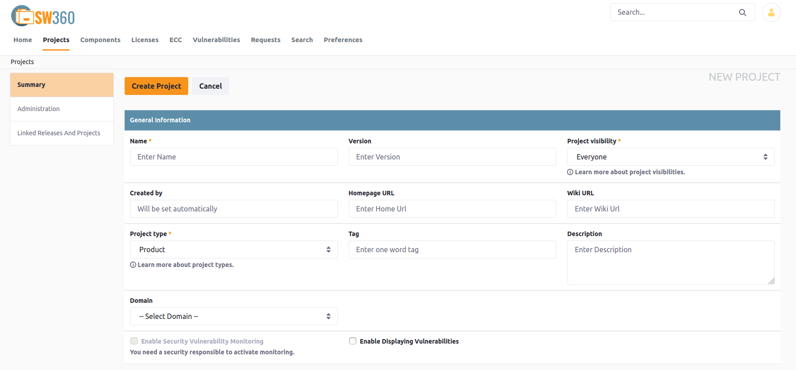

[//]: # (Copyright Siemens AG, 2021. Part of the SW360 Portal Project)
[//]: # (This program and the accompanying materials are made)
[//]: # (available under the terms of the Eclipse Public License 2.0)
[//]: # (which is available at https://www.eclipse.org/legal/epl-2.0/)
[//]: # (SPDX-License-Identifier: EPL-2.0)

#Projects
-----------------------

## Create a New Project
Navigate to your project overview by clicking the menu item **Projects**.

On top of the project list you can find a button **Add Project**. The activation of the button shows a screen where you can add information about your project.

***SUMMARY SECTION***

**General Information** includes the following fields:

- **Name***: Project name
- **Version**: Form of something that is different in some way from other forms. Version of the project
- **Project Visibility***: Possible values can be Everyone(default), Me and Moderators, Group and Moderators, Private
- **Created By**: Owner of the project which will be set automatically
- **Homepage URL**: Link that leads to the homepage
- **Wiki URL**: Link that leads to the wiki
- **Project Type***: Different types can be Product(default), Inner Source, Service, Internal Project, Customer Project
- **Tag**: One word tag, to make the search faster
- **Description**: Explanation regarding the newly created project
- **Domain**: The domain, possible values are Application Software, Documentation, Embedded Software, Hardware, Test, Diagnostics

**Roles** includes the following fields:

- **Group***: The group of the project owner
- **Project Manager**: User that manages the project
- **Project Owner**: Holder of the project
- **Owner Accounting Unit**: The owner accounting unit of the project
- **Owner Billing Unit**: The owner billing unit of the project
- **Owner Country**: The owner country of the project
- **Lead Architect**: The lead architect of the project
- **Moderators**: List of moderators responsible for the project
- **Contributors**: List of contributers responsible for the project
- **Security Responsibles**: List of users responsible for security of the project

Can also add **Additional Roles**, **External Ids** and **Additional Data** in this section.

***ADMINISTRATION SECTION***

**Clearing** includes the following fields:

- **Project clearing state**: Different states can be Open, Closed, In Progress
- **Clearing Team**: Team responsible for the project clearing
- **Deadline for pre-evaluation**: Pre-evaluation date in the format, YYYY-MM-DD
- **Obligations and other comment fields**

**Lifecycle** includes the following fields:

- **Project State***: Different states can be Active, Phaseout, Unknown
- **System Test Begin**: Date of the project system begin phase
- **System Test End**: Date of the project system end phase
- **Delivery Start Date**: The project delivery start date
- **Phase-out Date**: The project phase-out date

This section also includes **License Info Header**.

***LINKED RELEASES AND PROJECTS SECTION***

In this section we can link the existing **Projects** and **Releases** to the new project.

To finish the creation of the new project press the button "Create Project". The list of projects is updated and should contain the newly created project.

## Create a New Version (copy) of an Existing Project

Step-by-step:

1. Go to 'Projects'

2. Search for the project

3. Click on the 'Duplicate' symbol in right-most 'Actions' column(third symbol)

4. Click 'Update Project'

5. Done

## Remove a Project

Step-by-step:

1. Go to 'Projects'

2. Search for the project

3. Click on the trash can icon on the right side of the project

4. Acknowledge remove warning

5. Done
